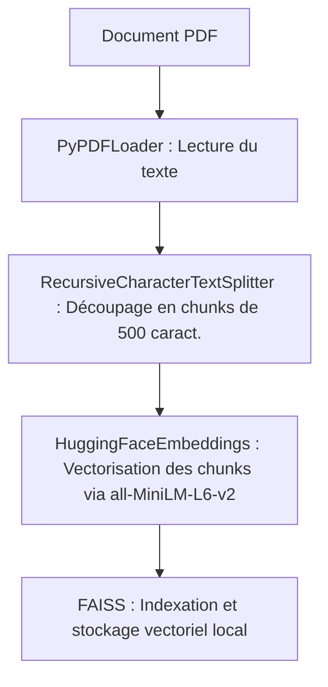
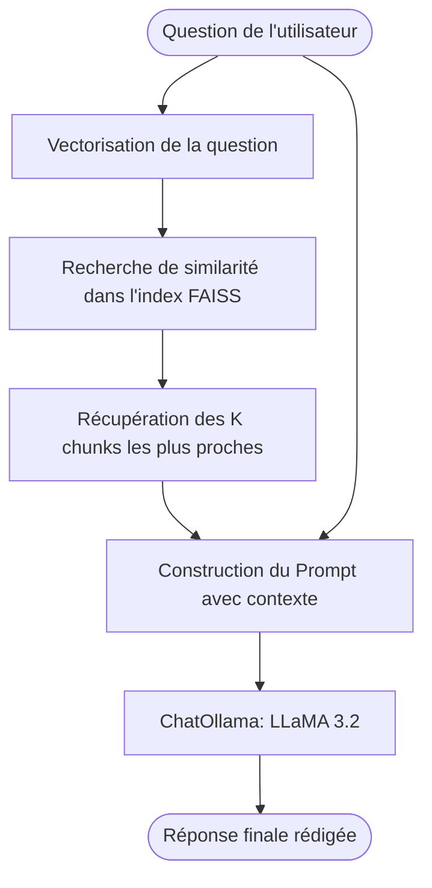
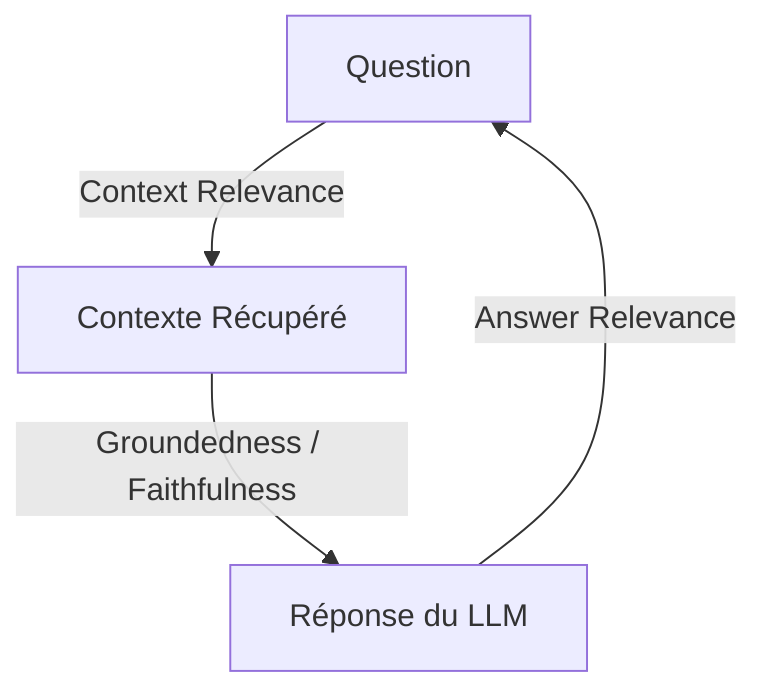

# Assitant-ai-based-on-RAG-
Ce projet développe un assistant de recherche intelligent basé sur l’architecture RAG. Il combine LLaMA 3.2 (via Ollama) et FAISS pour interroger des documents PDF en langage naturel. Le système identifie les passages les plus pertinents et génère des réponses précises en s’appuyant uniquement sur le contenu des documents.

# Assistant RAG Local (LLaMA 3.2 + FAISS + LangChain)

Ce projet implémente un système de **Génération Augmentée par Récupération (RAG - Retrieval-Augmented Generation)** entièrement local. Il permet de poser des questions en langage naturel sur un document PDF et d'obtenir des réponses précises générées par un modèle de langage (LLM), basées uniquement sur le contenu du document.

---

##  Qu'est-ce que le RAG et à quoi sert-il ?
Les modèles de langage (LLM) comme LLaMA ont des connaissances générales mais ne connaissent pas vos documents privés. Le **RAG (Retrieval-Augmented Generation)** résout ce problème en combinant deux étapes :
1. **Retrieval (Récupération) :** Recherche dans votre document les passages les plus pertinents par rapport à votre question.
2. **Generation (Génération) :** Donne ces passages en guise de contexte au LLM et lui demande de rédiger une réponse précise.

### Avantages du RAG :
- **Pas d'hallucinations :** Le modèle répond en se basant uniquement sur vos documents.
- **Sécurité et Confidentialité :** Tout tourne à 100% en local sur votre machine. Aucune donnée n'est envoyée à des serveurs tiers.
- **Pas de réentraînement :** Pas besoin d'entrainer un modèle coûteux, il suffit d'indexer le document.

---

## Architecture du Système

Le pipeline se déroule en deux grandes phases :

### 1. Phase d'Ingestion des Données (`ingest.py`)

### 2. Phase de Question-Réponse / RAG (`qa.py` & `app.py`)

---

##  Détails Techniques des Composants
- **LangChain** : Framework d'orchestration pour relier le chargement des documents, la recherche vectorielle et le LLM.
- **PyPDFLoader** : Chargeur de document pour extraire le texte brut des pages du PDF.
- **RecursiveCharacterTextSplitter** : Découpe le texte en segments (chunks) de 500 caractères avec un chevauchement (overlap) de 50 caractères pour éviter de couper des phrases au milieu et conserver le contexte.
- **HuggingFaceEmbeddings (all-MiniLM-L6-v2)** : Modèle d'embeddings local qui transforme chaque segment de texte en un vecteur numérique de 384 dimensions représentant sa signification sémantique.
- **FAISS (Facebook AI Similarity Search)** : Bibliothèque optimisée pour stocker les vecteurs et effectuer des recherches de similarité ultra-rapides.
- **ChatOllama (LLaMA 3.2 - 3B)** : Modèle de langage local exécuté par Ollama. Il reçoit la question et les segments pertinents pour générer une réponse fluide et correcte.

---

---

## Comment évaluer la fiabilité de notre RAG ?

Pour s'assurer que le RAG donne des réponses fiables et n'invente rien (hallucinations), on évalue le système selon **la Triade du RAG** :

### 1. Les 3 métriques clés de fiabilité
*   **Fidélité (Faithfulness / Groundedness) :** Est-ce que la réponse générée provient *uniquement* du contexte récupéré ? (Permet de mesurer si le modèle hallucine).
*   **Pertinence de la réponse (Answer Relevance) :** Est-ce que la réponse répond directement et précisément à la question posée par l'utilisateur ?
*   **Pertinence du contexte (Context Precision / Recall) :** Est-ce que le système de recherche a bien récupéré les bons passages du PDF nécessaires pour répondre à la question ?

### 2. Méthodologie pratique de test
*   **Créer un jeu de données de test (Ground Truth) :** Préparez une liste de 10 à 20 questions réelles sur votre document avec les réponses attendues (rédigées manuellement).
*   **Tests manuels et scénarios limites (Edge Cases) :**
    *   *Question hors sujet :* Posez une question qui n'a aucun rapport avec le document (le RAG doit répondre "Je ne sais pas" ou "L'information n'est pas présente dans le document").
    *   *Question contradictoire :* Testez la résistance du LLM aux biais.
*   **Évaluation automatisée avec Ragas / TruLens :** 
    Vous pouvez intégrer la bibliothèque Python `ragas` pour calculer automatiquement des scores de fidélité et de pertinence sur votre jeu de test.
=======

